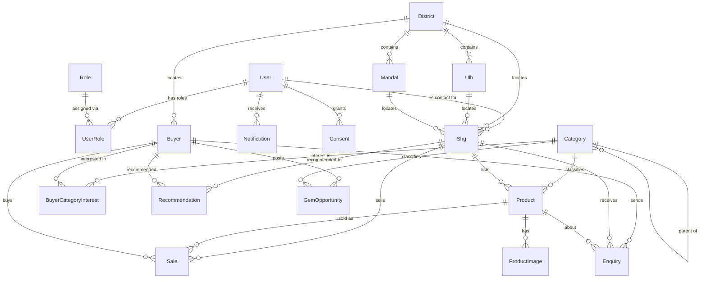

# Data model

**Source of truth:** [`database/prisma/schema.prisma`](../database/prisma/schema.prisma) — every field, relation, index, and the _why_ behind non-obvious choices (column widths, `onDelete` behavior, encryption) is commented there already. This document is a map on top of it, not a duplicate — read the schema itself for anything this page doesn't cover.

21 models, one PostgreSQL 16 instance with `postgis`, `vector` (pgvector), and `pgcrypto` extensions (ADR-0004) — deliberately one engine, not three separate geo/vector/relational stores, to keep this pilot's operational surface (backups, encryption, access control, DPDP audit) to one thing instead of three.

## Entity-relationship diagram

Geo-tagged rows (`Shg.location`, `Product.location`, `Buyer.location`) and embedding columns (`Product.embedding`, `Buyer.embedding`, `SchemeChunk.embedding`) are declared `Unsupported(...)` in Prisma's schema — Prisma has no native PostGIS `geometry`/pgvector `vector` column type, so these are written/read via raw `$queryRaw`/`$executeRaw` (see `apps/core-api/src/shgs/shgs.service.ts` and `apps/ml-services/app/*/repository.py` for the actual SQL), not the typed Prisma client, for exactly those columns.

## Models by module

| Model(s)                                                              | Module                                       | Notes                                                                                                                                                                                                                                                                                                                                                        |
| --------------------------------------------------------------------- | -------------------------------------------- | ------------------------------------------------------------------------------------------------------------------------------------------------------------------------------------------------------------------------------------------------------------------------------------------------------------------------------------------------------------ |
| `User`, `Role`, `UserRole`                                            | Identity & RBAC                              | `UserRole` optionally scopes a role to one `District` or `Ulb` — a `DISTRICT_OFFICIAL` row is scoped by `districtId`, a plain `SHG`/`ADMIN` row has neither. Phone-OTP is the only login; there is no password field.                                                                                                                                        |
| `District`, `Ulb`, `Mandal`, `Category`, `FestivalCalendar`           | Master data                                  | `Category` is self-referencing (2-level: e.g. "Food Products" → "Pickles"). `FestivalCalendar` rows are forecasting regressors (T15/ADR-0024), not calendar-UI content.                                                                                                                                                                                      |
| `Shg`, `Product`, `ProductImage`                                      | Module 1 — SHG Product Registry              | `Shg.contactUserId` is a **required** FK — this is why right-to-erasure (ADR-0031) anonymizes a user instead of hard-deleting: a real SHG can never be left with no contact user. `Product.embedding` backs content-based buyer matching (ADR-0026), not categorization — categorization computes its embedding on the fly and never persists it (ADR-0017). |
| `Buyer`, `BuyerCategoryInterest`, `Sale`, `Enquiry`, `Recommendation` | Module 4 — Buyer Matching Engine             | `Recommendation.reasons` holds the explainability output (SHAP-derived once a ranker exists, template-based until then — ADR-0026) as JSON, not a separate table. `Sale` is real transaction history used both for analytics (Module 5/7) and as the demand-forecasting training signal (T14/T15).                                                           |
| `GemOpportunity`                                                      | Module 4 / External integrations             | `isSimulated` is `true` for every row today — no real GeM feed exists yet (ADR-0025); the column exists so a real feed's rows can coexist with seeded ones without a migration.                                                                                                                                                                              |
| `Notification`                                                        | Module 6 — Notification Engine               | One row per attempted send, not per logical event — a `BUYER_ENQUIRY` event fanned out to SMS+WhatsApp is two rows. `notification-service`, not `core-api`, owns this table (separate Prisma schema copy — see ADR-0022 for why).                                                                                                                            |
| `Consent`, `AuditLog`                                                 | DPDP Act 2023 compliance                     | `Consent` is append-only (never updated in place) so a full grant/withdraw history is always reconstructable. `AuditLog.hash`/`previousHash` form a real, verifiable hash chain (ADR-0031) — see `AuditService.verifyChain()`.                                                                                                                               |
| `SchemeChunk`                                                         | Module 2 — Voice Assistant (scheme guidance) | RAG source content for the `scheme_guidance` tool (ADR-0021). Small and hand-curated (six real schemes), not a general document store.                                                                                                                                                                                                                       |

## Real, non-obvious constraints worth knowing before writing a migration

- **`Shg.contactUserId` is required.** There is no way to delete a `User` who is any SHG's contact without first reassigning or anonymizing. This is deliberate (ADR-0004/ADR-0030 both cite it as a reason to avoid schema changes that would relax it) — right-to-erasure works around it by anonymizing instead of deleting (ADR-0031).
- **Embeddings are 384-dimensional everywhere** (`Product`, `Buyer`, `SchemeChunk`) — matching `sentence-transformers/paraphrase-multilingual-MiniLM-L12-v2`, the one embedding model this platform runs (ADR-0017). A different model would mean a migration touching all three columns, not just ml-services config.
- **`Shg.bankIfsc` is `VarChar(255)`, not `VarChar(11)`** (a real IFSC code's exact length) — it was widened during T22 when pgcrypto ciphertext (base64, ~10x longer than plaintext) started being stored there instead of plaintext. A real bug found by live verification, not a design choice made up front — see ADR-0031.
- **No `members` count exists anywhere** — an SHG's member headcount was never tracked by this platform (ADR-0027 explicitly declined to fabricate this metric for the analytics/dashboard layer rather than invent a fake number).
